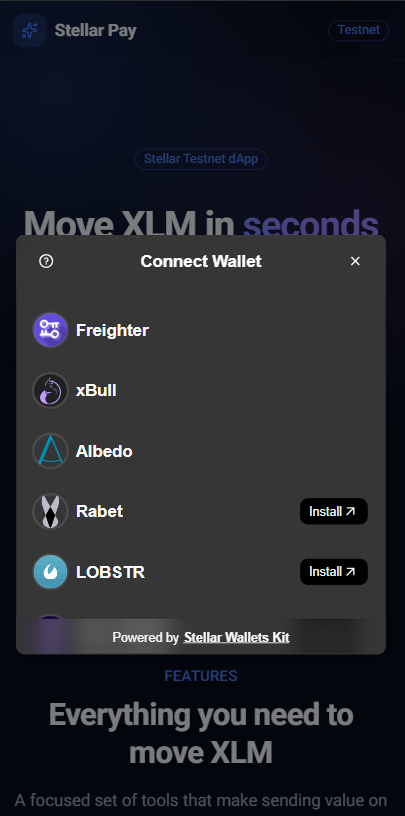
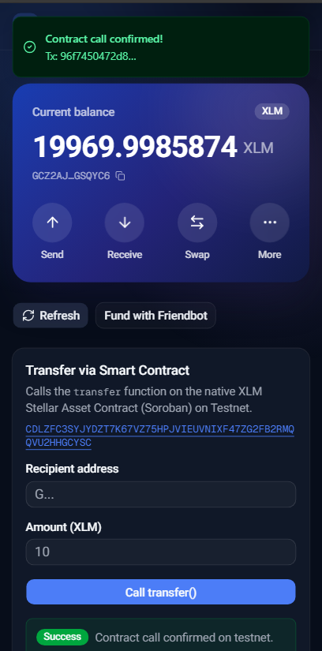
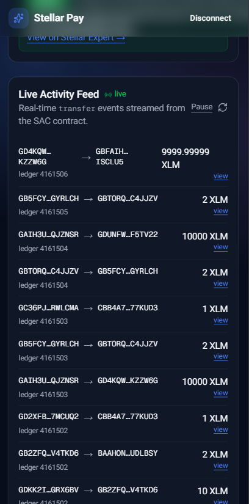

# Stellar Pay — Yellow Belt (Level 2) Testnet dApp

A multi-wallet Stellar dApp built for the **Level 2 – Yellow Belt** challenge.
Connect any supported wallet, call a **Soroban smart contract** on the Stellar
Testnet, watch **real-time contract events** stream in, and track transaction
status from pending → success/failure.

Built with **Next.js (App Router)**, **TypeScript**, **Tailwind CSS**, and
**shadcn/ui**, using the official `@stellar/stellar-sdk`, the Soroban RPC, and
**Stellar Wallets Kit** for multi-wallet support.

## Level 2 Requirements → Where they live

| Requirement                         | Implementation                                                                 |
| ----------------------------------- | ------------------------------------------------------------------------------ |
| Multi-wallet integration            | `src/lib/wallet-kit.ts` — Stellar Wallets Kit (Freighter, xBull, Albedo, Rabet, LOBSTR, Hana) |
| 3+ error types handled              | `src/lib/errors.ts` — `wallet_not_found`, `user_rejected`, `insufficient_balance`, `wrong_network`, `network` |
| Contract deployed on testnet        | Native XLM **Stellar Asset Contract (SAC)** + optional custom contract in `contracts/` |
| Contract called from the frontend   | `src/lib/soroban.ts` → `transferViaContract()` / `readContractBalance()`       |
| Transaction status visible          | `src/components/contract-transfer.tsx` — simulating → signing → submitting → confirming → success/failed |
| Event listening / state sync        | `src/components/activity-feed.tsx` polls `fetchTransferEvents()` every 8s      |

## Key Addresses & Hashes

- **Deployed contract address (native XLM SAC, Testnet):**
  `CDLZFC3SYJYDZT7K67VZ75HPJVIEUVNIXF47ZG2FB2RMQQVU2HHGCYSC`
  ([view on Stellar Expert](https://stellar.expert/explorer/testnet/contract/CDLZFC3SYJYDZT7K67VZ75HPJVIEUVNIXF47ZG2FB2RMQQVU2HHGCYSC))
- **Transaction hash of a contract call:** _paste the hash from a successful
  `transfer()` call here (the app prints it with a Stellar Expert link)._

## Features

- 🔐 **Multi-wallet** — connect Freighter, xBull, Albedo, Rabet, LOBSTR, or Hana
  via a single modal (Stellar Wallets Kit)
- 📝 **Smart-contract calls** — invoke `transfer` on the native XLM SAC and read
  balances via read-only simulation (no fee)
- 📡 **Real-time events** — a live activity feed streams SAC `transfer` events
- ⏳ **Transaction status** — clear pending phases and success/failure states
  with a verifiable Stellar Expert link
- 🧯 **Robust error handling** — wallet-not-found, user-rejected, and
  insufficient-balance are all handled with actionable messages
- 💰 **Balance + Friendbot** — view your balance and fund a new account

## Tech Stack

| Layer      | Choice                                        |
| ---------- | --------------------------------------------- |
| Framework  | Next.js (App Router) + React 19               |
| Language   | TypeScript                                    |
| Styling    | Tailwind CSS v4 + shadcn/ui                   |
| Wallets    | Stellar Wallets Kit (multi-wallet)            |
| Blockchain | Stellar SDK (Horizon + Soroban RPC)           |
| Contract   | Native XLM Stellar Asset Contract (Soroban)   |
| Network    | Stellar Testnet                               |

## Prerequisites

- [Node.js](https://nodejs.org/) 18.18+ (or 20+)
- A supported Stellar wallet set to **Testnet** (e.g. the
  [Freighter](https://www.freighter.app/) browser extension)

## Getting Started (run locally)

```bash
# 1. Install dependencies
npm install

# 2. Start the dev server
npm run dev

# 3. Open the app
# Visit http://localhost:3000
```

Then in the app:

1. Click **Connect Wallet** and pick your wallet in the modal.
2. If your account is new, click **Fund with Friendbot** to receive testnet XLM.
3. Under **Transfer via Smart Contract**, enter a recipient and amount, then
   click **Call transfer()**. Approve it in your wallet.
4. Watch the status advance (simulating → signing → submitting → confirming) and
   see the confirmed tx hash + explorer link.
5. Watch the **Live Activity Feed** pick up `transfer` events in real time.

## Available Scripts

```bash
npm run dev     # start the development server
npm run build   # create a production build
npm run start   # run the production build
npm run lint    # run ESLint
```

## Project Structure

```
src/
├─ app/
│  ├─ layout.tsx            # root layout + toast provider
│  └─ page.tsx              # main UI (wallet, contract call, feed, payment)
├─ components/
│  ├─ contract-transfer.tsx # Soroban contract call + tx status
│  ├─ activity-feed.tsx     # real-time contract event feed
│  ├─ send-payment.tsx      # classic Horizon payment
│  └─ ui/                   # shadcn/ui components
├─ hooks/
│  └─ use-wallet.ts         # connect/disconnect + balance + sign
└─ lib/
   ├─ wallet-kit.ts         # multi-wallet integration (Stellar Wallets Kit)
   ├─ soroban.ts            # Soroban contract calls, events, tx status
   ├─ errors.ts             # error classification (3+ types)
   ├─ freighter.ts          # legacy Freighter helpers / install URL
   └─ stellar.ts            # Horizon queries + payment building

contracts/
└─ activity_log/            # optional custom Soroban contract (Rust) + docs
```

## Screenshots

> Replace the placeholders below with your own screenshots.

**Wallet options available (multi-wallet modal)**



**Smart-contract call — transaction status**



**Live activity feed (contract events)**



## Custom Contract (optional)

A small custom Soroban contract lives in [`contracts/`](contracts/README.md)
with build, test, deploy, and invoke instructions. The web app uses the native
XLM SAC by default so it runs without a Rust toolchain.

## Notes

- This app targets the **Stellar Testnet only**. Do not use it with mainnet funds.
- Testnet data is periodically reset by the Stellar network.

## License

MIT
