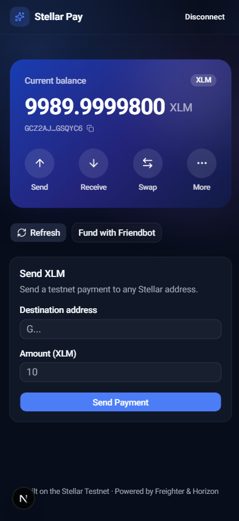
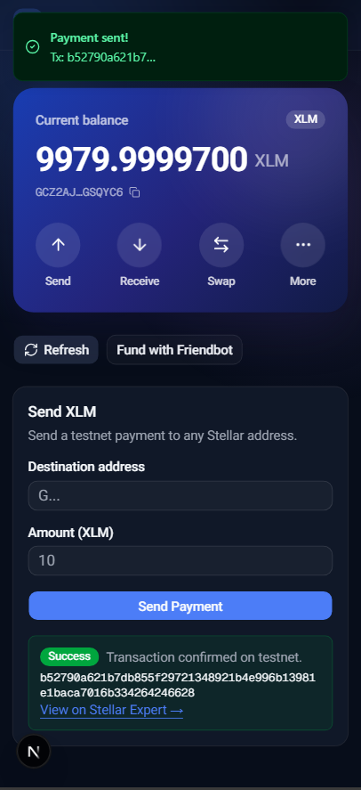

# Stellar Pay — White Belt Testnet dApp

A beginner-friendly Stellar dApp built for the **Level 1 – White Belt** challenge.
Connect a [Freighter](https://www.freighter.app/) wallet, view your XLM balance,
fund your account from Friendbot, and send XLM payments — all on the **Stellar
Testnet**.

Built with **Next.js (App Router)**, **TypeScript**, **Tailwind CSS**, and
**shadcn/ui**, using the official `@stellar/stellar-sdk` and
`@stellar/freighter-api`.

## Features

- 🔌 **Wallet connection** — connect and disconnect the Freighter wallet
- 🌐 **Testnet enforced** — verifies Freighter is set to the Stellar Testnet
- 💰 **Balance display** — fetches and shows the connected account's XLM balance
- 🚰 **Friendbot funding** — one-click request for 10,000 testnet XLM
- 💸 **Send payments** — send XLM to any Stellar address with input validation
- ✅ **Transaction feedback** — clear success/failure states, the transaction
  hash, and a link to view it on Stellar Expert

## Tech Stack

| Layer      | Choice                                   |
| ---------- | ---------------------------------------- |
| Framework  | Next.js (App Router) + React 19          |
| Language   | TypeScript                               |
| Styling    | Tailwind CSS v4 + shadcn/ui              |
| Blockchain | Stellar SDK (Horizon) + Freighter API    |
| Network    | Stellar Testnet                          |

## Prerequisites

- [Node.js](https://nodejs.org/) 18.18+ (or 20+)
- The [Freighter](https://www.freighter.app/) browser extension, set to **Testnet**

## Getting Started (run locally)

```bash
# 1. Install dependencies
npm install

# 2. Start the dev server
npm run dev

# 3. Open the app
# Visit http://localhost:3000
```

Then in the app:

1. Click **Connect Freighter** and approve the connection.
2. If your account is new, click **Fund with Friendbot** to receive testnet XLM.
3. Your **XLM balance** is displayed once connected.
4. Enter a destination address and amount, then click **Send Payment**.
5. Approve the transaction in Freighter — the app shows the result and tx hash.

## Available Scripts

```bash
npm run dev     # start the development server
npm run build   # create a production build
npm run start   # run the production build
npm run lint    # run ESLint
```

## Project Structure

```
src/
├─ app/
│  ├─ layout.tsx        # root layout + toast provider
│  └─ page.tsx          # main UI (wallet card, balance, actions)
├─ components/
│  ├─ send-payment.tsx  # payment form + transaction feedback
│  └─ ui/               # shadcn/ui components
├─ hooks/
│  └─ use-wallet.ts     # wallet connect/disconnect + balance state
└─ lib/
   ├─ freighter.ts      # Freighter wallet integration
   └─ stellar.ts        # Horizon queries + transaction building
```

## Screenshots

> Replace the placeholders below with your own screenshots.

**Wallet connected state**



**Balance displayed**


**Successful testnet transaction / result shown to user**



## Notes

- This app targets the **Stellar Testnet only**. Do not use it with mainnet funds.
- Testnet data is periodically reset by the Stellar network.

## License

MIT
